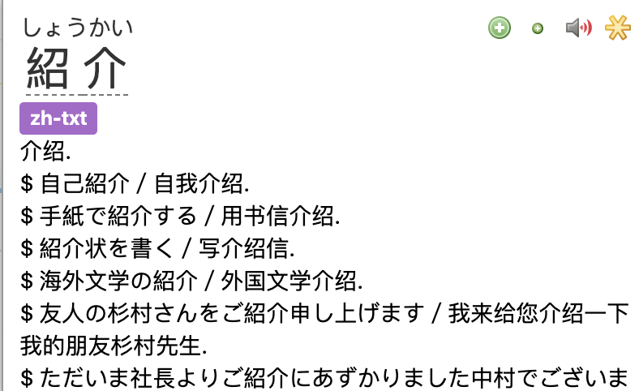

# JCdict - JSON Formatter

This is a tool similar to [yomichan-import](https://github.com/FooSoft/yomichan), which turns dictionaries to the JSON format so as to be imported to [yomichan](https://github.com/FooSoft/yomichan).\
Yet this tool is built for Chinese users, specifically 拼音(if exists) will be removed, and the part-of-speech will be shown in Chinese (e.g. 名词 instead of noun)

<p align="center">
  
</p>

Support conversions from 
- XiaoXueTang-JC in .txt format
- Daijisen in EPWING format (dup. from [yomichan-import](https://github.com/FooSoft/yomichan))

## Usage (XiaoXueTang-JC)
首先使用 [pyglossary](https://github.com/ilius/pyglossary) 把 .ifo 格式的小学馆中日字典转为 .txt 格式，然后
``` 
$ git clone https://github.com/playHing/jcdict-formatter
$ cd jcdict-formatter && go build
$ ./jcdict-formatter [path-to-XiaoXueTang-JC.txt]
```
再于 yomichan 中导入生成出的 .zip 文件即可\
有任何问题欢迎在 issue 提问

## Todo
- support part-of-speech of XiaoXueTang-JC by integrating with Daijisen