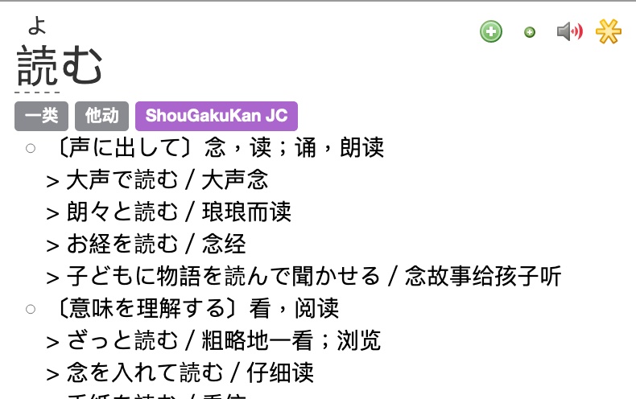

# JCdict Formatter

This is a tool similar to [yomichan-import](https://github.com/FooSoft/yomichan), which turns dictionaries to the JSON format so as to be imported to [yomichan](https://github.com/FooSoft/yomichan).\
Yet this tool is built for Chinese users, specifically 拼音(if exists) are removed, and parts-of-speech are shown in Chinese (e.g. '名词' instead of 'noun' or 'n')

<p align="center">
  
</p>

Support conversions from 
- ShouGakuKan-JC in .txt format (with JMDict as supportor for parts-of-speech)
- Daijisen in EPWING format (dup. from [yomichan-import](https://github.com/FooSoft/yomichan))

## Usage (ShouGakuKan-JC)
首先使用 [pyglossary](https://github.com/ilius/pyglossary) 把 .ifo 格式的小学馆中日字典转为 .txt 格式，然后
``` 
$ git clone https://github.com/playHing/jcdict-formatter
$ cd jcdict-formatter && go build
$ ./jcdict-formatter --supportdict=path-to-jmdict_e path-to-ShouGakuKan-JC.txt
```
再于 yomichan 中导入生成出的 .zip 文件即可\
有任何问题欢迎在 issue 提问